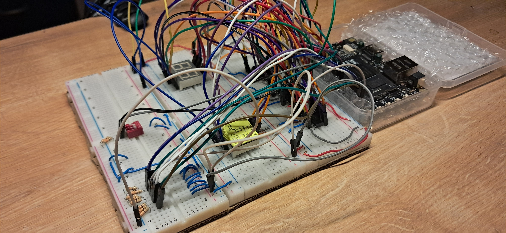
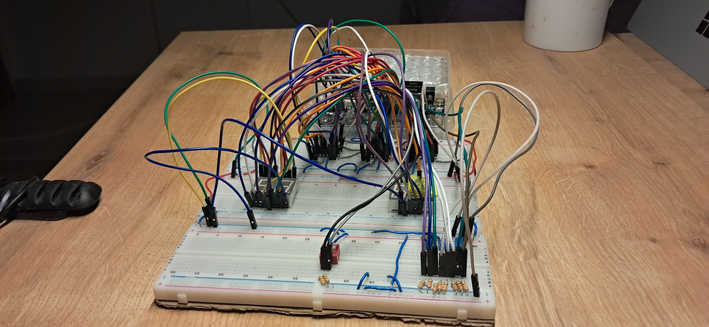
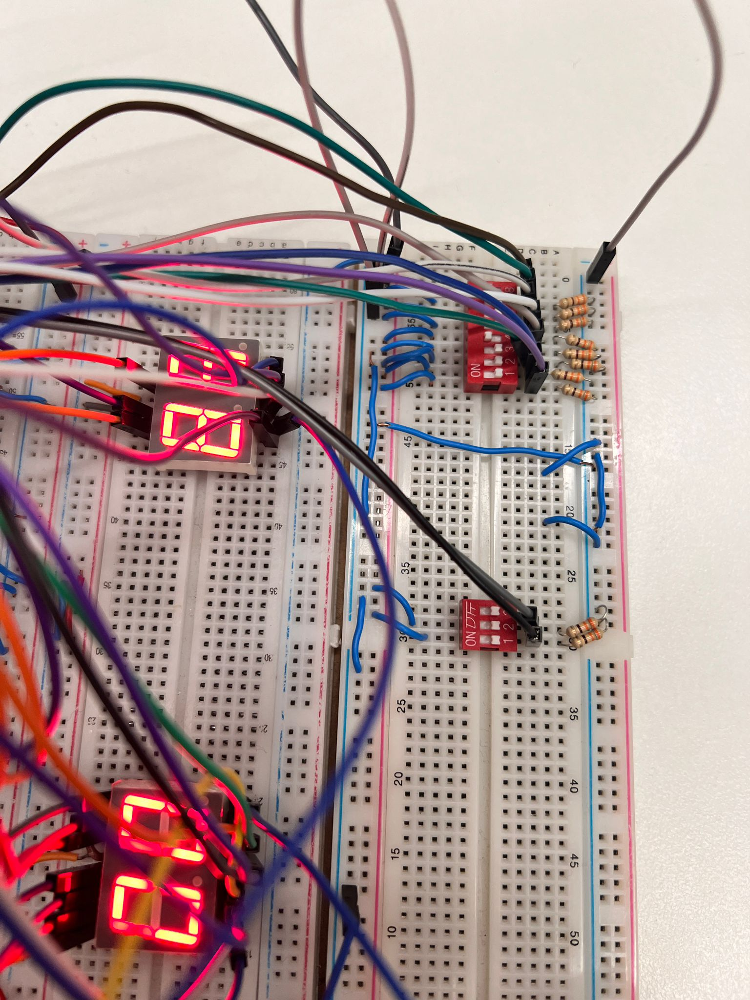
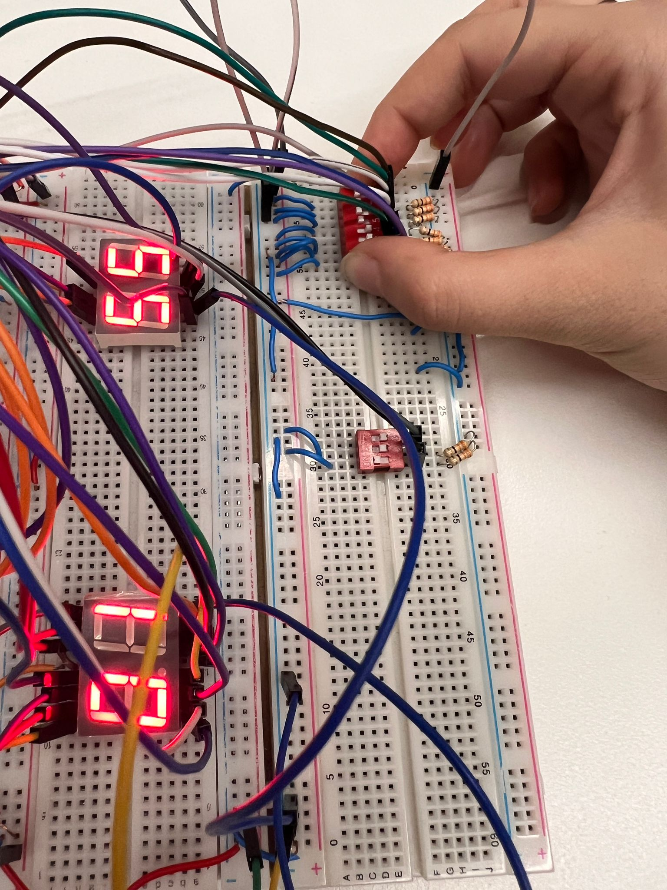

# 4-Bit Arithmetic Logic Unit (ALU) & 8-Bit Multiplication

- This project was originally designed for TTL-based implementation but was estimated to require approximately 100 TTL chips. 
- Consequently, it is now being revisited for FPGA implementation using the Tang Primer 20k. The circuit also includes a 7-segment display and a 4511 TTL chip for BCD-to-7SD encoding.
- Additionally, old and unused Verilog and Logisim files are being included in the repository.
- Gowin Education v1.9.9.03 & Logisim Evolution v3.9.0

## Circuit Design

- All bits are **unsigned**.
- The circuit uses an 8-input DIP switch for **A** and **B**, a 3-input opcode selector, and a 1-bit CarryIn/BorrowIn input (depending on the opcode).
- The BCD module employs a double dabble algorithm, but the 3rd and 4th bits in the 100s position are not enabled. As a result, the integer "400" cannot be displayed on the 7-segment display.
- The opcode uses a 3-bit decoder with **one-hot encoding** for selection.
- CarryOut/BorrowOut and Overflow are displayed using LEDs.
- **The 1's are displayed on the double 7-segment display. Yes, we encountered a component issue.**

### **Inputs:**

- **2-Bit Selector:** Determines which data is displayed on the screen.
- **3-Bit OpCode:** Specifies the operation to be performed.
- **4-Bit Input A:** The first operand.
- **4-Bit Input B:** The second operand.
- **1-Bit CarryIn/BorrowIn:** Input carry for arithmetic operations.

### **Outputs:**

- **11-Bit Result:** The ALU converts the binary result to BCD. This feature can be easily disabled if binary output is preferred.
- **1-Bit CarryOut/BorrowOut:** Indicates carry or borrow in arithmetic operations.
- **1-Bit Overflow:** Indicates an overflow condition during addition.

### Preview

Click to expand and view media of the real-life circuit.

opCode

<video controls>
<source src="media/opCode.mp4" type="video/mp4">
</video>

A&B Input

A input

B input

Logic Unit

AND Gate

<video controls>
<source src="media/and.mp4" type="video/mp4">
</video>

OR Gate

<video controls>
<source src="media/or.mp4" type="video/mp4">
</video>

XOR Gate

<video controls>
<source src="media/xor.mp4" type="video/mp4">
</video>

Arithmetic Unit

Addition & Addition with CarryIN

<video controls>
<source src="media/additionCarryIN.mp4" type="video/mp4">
</video>

Addition & Overflow and CarryOut led

<video controls>
<source src="media/overflow.mp4" type="video/mp4">
</video>

Subtraction & BorrowOut Led

<video controls>
<source src="media/borrow.mp4" type="video/mp4">
</video>

8-2 with Borrow In

<video controls>
<source src="media/borrowin.mp4" type="video/mp4">
</video>

Multiplication

<video controls>
<source src="media/multiplication.mp4" type="video/mp4">
</video>

## Screen Selector Table

The 2-bit screen selector determines what is displayed on the screen:

| **Screen Selector** | **Displayed Data** |
| ------------------- | ------------------ |
| 00                  | Input A            |
| 01                  | Input B            |
| 10                  | opCode             |
| 11                  | Result             |

## Opcode Table

The table below describes the operations performed by the ALU based on the 3-bit opcode:

| **Opcode** | **Operation**  | **Result Bits** | **Carry/Borrow In/Out Usage** |
| ---------- | -------------- | :-------------: | :--------------------: |
| 000        | Addition       |        4        |           ✅           |
| 001        | Subtraction    |        4        |           ✅           |
| 010        | Multiplication |        8        |           ❌           |
| 100        | AND            |        4        |           ❌           |
| 101        | OR             |        4        |           ❌           |
| 110        | XOR            |        4        |           ❌           |
| 011        | ❌             |       ❌       |           ❌           |
| 111        | ❌             |       ❌       |           ❌           |

  
# Important NOTE!

## You are free to use this repository as you wish, **but please note that I am not actively maintaining it.** This repository was created for a specific project, and I would like to preserve the original code.

## Credit

- [**BUR4KBEY**](https://github.com/BUR4KBEY): Honorable mention for resolving DIP switch assignments in the FloorPlanner(Gowin). Also for this readme template.